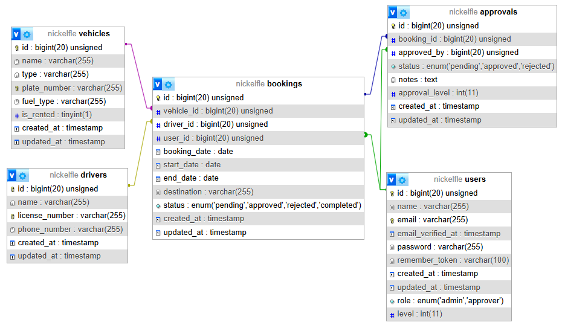
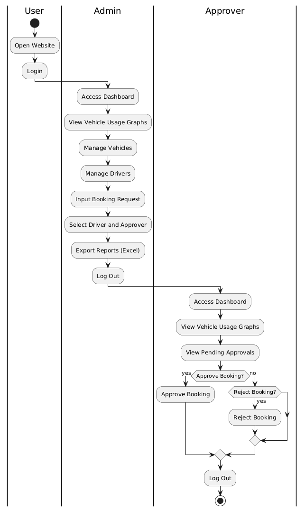

# NickelFleet

NickelFleet is a fleet management application that allows users to manage vehicle bookings and approvals with ease.

## User Credentials

| Username                   | Password      | Role             |
|----------------------------|---------------|------------------|
| admin@gmail.com            | adminadmin    | Admin            |
| approver1@gmail.com        | approver      | Approver Level 1 |
| approver2@gmail.com        | approver      | Approver Level 2 |

## Database Version
- MySQL 8.0.37

## PHP Version
- PHP 8.2.4

## Framework
- Laravel 11.28.1

## Physical Data Model


## Activity Diagram


## Usage Guide

1. **Installation**
   - Clone this repository to your local machine:
     ```bash
     git clone https://github.com/ayyrinn/NickelFleet.git
     ```
   - Navigate to the project directory:
     ```bash
     cd NickelFleet
     ```
   - Install dependencies using Composer:
     ```bash
     composer install
     ```
   - Install Node.js dependencies:
     ```bash
     npm install
     ```
   - Compile assets for development:
     ```bash
     npm run dev
     ```
   - Copy the `.env.example` file to `.env` and configure your database settings:
     ```bash
     cp .env.example .env
     ```
   - Generate the application key:
     ```bash
     php artisan key:generate
     ```

2. **Database Migration**
   - Run migrations to create the necessary tables in the database:
     ```bash
     php artisan migrate
     ```

3. **Database Seeder**
   - Run the seeder to populate the database with initial data:
     ```bash
     php artisan db:seed
     ```

4. **Running the Application**
   - Start the development server:
     ```bash
     php artisan serve
     ```
   - Access the application in your browser at `http://localhost:8000`.

5. **Logging Into the Application**
   - Use one of the registered accounts listed above to log in.

## Key Features
- Vehicle Booking Management
- Approval Process for Bookings
- Reporting and Data Export